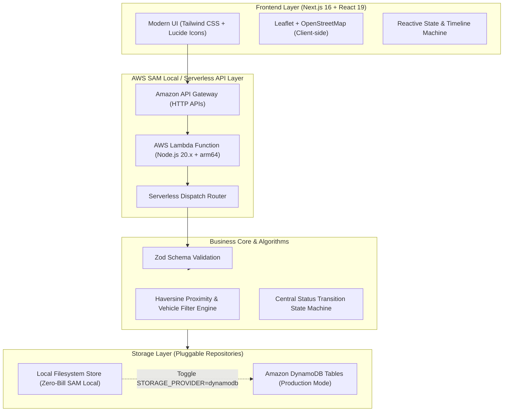

# 🚗 MechOnWay — On-Demand Intelligent Roadside Assistance

> **Built for the WeMakeDevs "First Commit" Hackathon — Bharat Builds Tour 2026**  
> **Track:** Build It (Open-Source AWS Local Stack with AWS SAM) & Best UI  
> **Repository:** [https://github.com/TechPrateek/MechOnWay](https://github.com/TechPrateek/MechOnWay)

---

## 🌟 Overview

**MechOnWay** is an Uber/Linear-inspired, modern roadside assistance platform engineered to connect stranded vehicle owners with qualified, nearby mechanics in minutes. 

Breakdowns are stressful, unpredictable, and often dangerous. MechOnWay replaces traditional chaotic phone calls and opaque wait times with an intelligent matching engine that pairs drivers with available technicians based on **real-time geographic proximity (Haversine formula)**, **vehicle compatibility**, and **service capability**.

---

## 🏗️ Architecture & AWS Stack ("Build It" Track)

MechOnWay is built locally using an **open-source AWS serverless architecture** powered by **AWS SAM (Serverless Application Model)**. It runs with zero cloud bill, zero credit card requirement, and zero cloud lock-in while maintaining complete parity with production AWS Lambda and DynamoDB.



### Key Technical Highlights
- **AWS SAM Local Backend**: Built with Node.js 20 runtime, configured in [`template.yaml`](./template.yaml) with Amazon API Gateway and AWS Lambda handler ([`src/serverless/lambda-handler.ts`](./src/serverless/lambda-handler.ts)).
- **Dual-Storage Provider Pattern**: Clean repository abstraction (`IRequestRepository`, `IMechanicRepository`) supporting:
  - **Local Persistence Mode (`STORAGE_PROVIDER=local`)**: Resilient filesystem-backed JSON storage with mutex locking, atomic file operations, and automatic mock re-seeding. Compatible with Windows, macOS, Linux, and AWS SAM Docker containers (`/tmp/mechonway-data`).
  - **Cloud Mode (`STORAGE_PROVIDER=dynamodb`)**: Managed Amazon DynamoDB persistence for production deployment (`MechOnWay-Requests` and `MechOnWay-Mechanics`).
- **Real-Time Lifecycle State Machine**: Centralized finite state machine enforcing strict status transitions:
  `SEARCHING` ➔ `MATCHED` ➔ `REQUESTED` ➔ `ACCEPTED` ➔ `ON_THE_WAY` ➔ `ARRIVED` ➔ `IN_SERVICE` ➔ `COMPLETED` / `CANCELLED`.
- **Deterministic Mechanic Matching**: Evaluates technician availability, vehicle compatibility (EV, Motorcycle, Truck, Sedan), equipment specializations, and Haversine distance. Includes active dispatch collision prevention to avoid double-booking busy technicians.

---

## 🚀 Quick Start (Local Development)

### 1. Prerequisites
- **Node.js 20+**
- **npm**
- *(Optional for SAM Local)* **AWS SAM CLI** & **Docker**

### 2. Installation
```bash
# Clone repository
git clone https://github.com/TechPrateek/MechOnWay.git
cd MechOnWay

# Install dependencies
npm install
```

### 3. Run Frontend & Local API
```bash
npm run dev
```
Open [http://localhost:3000](http://localhost:3000) in your browser.

---

## ⚡ Running with AWS SAM Local

You can run the backend serverless API entirely locally using AWS SAM CLI without an AWS account:

```bash
# 1. Validate the SAM Template
sam validate --region ap-south-1

# 2. Build the Serverless Lambda Artifacts with esbuild
sam build --region ap-south-1

# 3. Start the Local API Gateway on port 3001
sam local start-api --port 3001
```

Once running, the API Gateway endpoints are live at `http://127.0.0.1:3001/api/...`.

---

## 🧪 Testing & Quality Assurance

MechOnWay is built with 100% test pass rates and strict linting standards:

```bash
# Run all unit and integration tests (Vitest)
npm test

# Run ESLint (0 errors, 0 warnings)
npm run lint

# Verify Production Build (Next.js 16 Turbopack)
npm run build
```

### Test Coverage Highlights
- **104 tests passed across 9 suites**:
  - `src/lib/matching/__tests__/engine.test.ts`: Haversine formula, multi-attribute ranking, tie-breaking, phone masking.
  - `src/lib/lifecycle/__tests__/status-machine.test.ts`: FSM state transitions, terminal state immutability, role permissions.
  - `src/lib/validations/__tests__/request-validation.test.ts`: Zod schema bounds, GPS coordinate limits, phone validation.
  - `src/lib/repositories/__tests__/local-repository.test.ts`: Concurrent writes, atomic renames, corruption recovery.
  - `src/serverless/__tests__/lambda-handler.test.ts`: End-to-end multi-step HTTP request lifecycle across separate Lambda invocations.

---

## 📡 API Reference

| Method | Endpoint | Description |
| :--- | :--- | :--- |
| `POST` | `/api/requests` | Creates a new roadside assistance request |
| `GET` | `/api/requests` | Lists all roadside assistance requests |
| `GET` | `/api/requests/:id` | Retrieves request details by ID |
| `POST` | `/api/requests/match` | Runs the matching engine to pair request with the nearest mechanic |
| `PATCH` | `/api/requests/:id` | Updates request status (`ARRIVED`, `IN_SERVICE`, `COMPLETED`, etc.) |
| `GET` | `/api/mechanics` | Lists registered mechanics with status and availability |

---

## 👥 Demo Flow

1. **Customer Dashboard**: Stranded driver visits the homepage, clicks **"Request Assistance"**, selects vehicle type (e.g. Car, EV, Motorcycle), and specifies issue (Flat Tyre, Battery Jump, Engine Stalling).
2. **Location Picker**: Uses browser geolocation or selects one of the pre-loaded San Francisco demo hotspots.
3. **Instant Matching Engine**: System calculates nearest eligible mechanics, displays ranking rationale, and assigns the technician.
4. **Live Request Tracking**: Real-time status timeline and interactive OpenStreetMap route visualization.
5. **Mechanic Dashboard**: Mechanics can toggle availability, view incoming requests, accept jobs, and update roadside progress in real time.

---

## 📜 License & Acknowledgments

- Built with ❤️ for **WeMakeDevs First Commit (Bharat Builds Tour 2026)**.
- Licensed under the **MIT License**.
