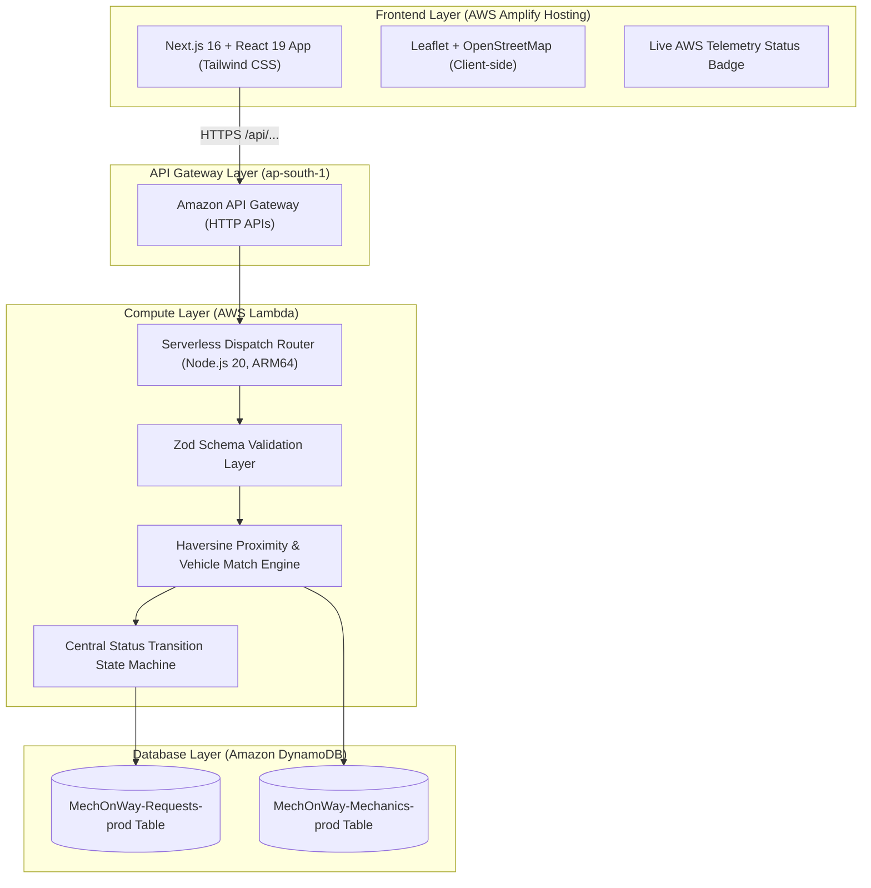

# 🚗 MechOnWay — On-Demand Intelligent Roadside Assistance

[](https://nextjs.org/)
[](https://react.dev/)
[](https://main.d1vqbdcnkkxe6z.amplifyapp.com)
[](https://aws.amazon.com/lambda/)
[](https://aws.amazon.com/dynamodb/)
[](https://vitest.dev/)

> **Built for the WeMakeDevs "First Commit" Hackathon — Bharat Builds Tour 2026**  
> **Track:** Ship It (Live Cloud Deployment on AWS) & Best UI  
> 🌐 **Live Web Application (AWS Amplify):** [https://main.d1vqbdcnkkxe6z.amplifyapp.com](https://main.d1vqbdcnkkxe6z.amplifyapp.com)  
> ⚡ **Live Serverless API (AWS API Gateway):** [https://nijdxn0jjb.execute-api.ap-south-1.amazonaws.com](https://nijdxn0jjb.execute-api.ap-south-1.amazonaws.com)  
> 📦 **GitHub Repository:** [https://github.com/TechPrateek/MechOnWay](https://github.com/TechPrateek/MechOnWay)  
> 📍 **Primary Region:** AWS Asia Pacific Mumbai (`ap-south-1`)

---

## 🌟 Overview

**MechOnWay** is an Uber/Linear-inspired, modern roadside assistance platform engineered to connect stranded vehicle owners with qualified, nearby mobile mechanics in minutes across India.

Breakdowns are stressful, unpredictable, and dangerous. MechOnWay replaces traditional chaotic phone calls, long hold times, and opaque towing surcharges with an intelligent, serverless matching engine that pairs drivers with available technicians based on **real-time geographic proximity (Haversine formula)**, **vehicle compatibility (Cars, EVs, Motorcycles, Trucks)**, and **service capability**.

### 🇮🇳 Pan-India National Roadside Network (All Over Bharat)
MechOnWay is architected from the ground up as an **all-India roadside assistance and highway dispatch ecosystem** designed to support motorists and transport fleets anywhere in the country:
- **National Highway & Expressway Coverage**: Engineered to serve India's vast arterial corridors including the **Golden Quadrilateral**, **NH-44**, **NH-48**, and access-controlled expressways (**Yamuna Expressway**, **Mumbai-Pune Expressway**, **Samruddhi Mahamarg**, **Purvanchal Expressway**, **Bangalore-Mysore Highway**, and **Delhi-Mumbai Expressway**).
- **Metro, Tier-2 & Tier-3 City Readiness**: Geospatially calibrated for both dense metropolitan traffic (Delhi NCR, Mumbai, Bengaluru, Hyderabad, Chennai, Kolkata, Pune) and underserved transit towns where organized mobile mechanics are historically scarce.
- **Dynamic Multi-Region Geo-Matching**: Employs spherical coordinate projection, flexible corridor geofencing, and variable emergency radius limits that adapt seamlessly across any Indian state or union territory.

### 📍 Active Pilot Corridor (Greater Noida & Delhi NCR Demonstration)
To provide an authentic, live end-to-end evaluation for the **WeMakeDevs Hackathon**, the Greater Noida & Delhi NCR highway cluster is actively seeded as our **live pilot launch zone**:
- **Pari Chowk, Greater Noida** (High-traffic commercial & metro confluence)
- **Knowledge Park III, Greater Noida** (University & institutional educational belt)
- **Noida-Greater Noida Expressway — Sector 142** (High-speed expressway corridor near Advant)
- **Sector 62 Electronic City, Noida** (Major IT & corporate tech park hub)
- **Yamuna Expressway Corridor — Zero Point** (Gateway to long-distance Agra/Lucknow transit)

---

## 🏗️ Production AWS Architecture ("Ship It" Track)

MechOnWay is architected and fully deployed using **AWS Serverless and Managed Services**:



### AWS Services Utilized
1. **AWS Amplify Hosting**: Continuous deployment, global CloudFront CDN edge distribution, and SSR support for Next.js 16.
2. **Amazon API Gateway (HTTP API)**: Ultra-low latency, serverless REST API endpoints with CORS support and payload routing.
3. **AWS Lambda**: Node.js 20 runtime on ARM64 Graviton architecture for efficient compute scaling and zero idle costs.
4. **Amazon DynamoDB**: Fully managed NoSQL tables (`MechOnWay-Requests-prod` and `MechOnWay-Mechanics-prod`) with on-demand capacity.
5. **AWS SAM (Serverless Application Model)**: Complete Infrastructure as Code defined in [`template.yaml`](./template.yaml).

---

## ⚡ Core Engineering Features

### 1. Multi-Factor Proximity & Capability Matching Engine
- **Haversine Distance & Realistic ETA**: Computes spherical distance between stranded driver coordinates and mobile mechanic units, calculating transit arrival times at 35 km/h urban/corridor transit speed.
- **Vehicle & Tool Compatibility**: Matches specific vehicle constraints (EV auxiliary battery booster, heavy winching, motorcycle puncture kit, hydraulic floor jacks).
- **75 km Regional Emergency Guard**: Rejects absurd cross-country matches with clear diagnostics if no verified unit is within 75 km.
- **Active Collision Prevention**: Prevents double-booking mechanics who are already engaged on an active job (`ACCEPTED`, `ON_THE_WAY`, `ARRIVED`, `IN_SERVICE`).
- **Stale Dispatch Auto-Recovery**: Dispatches older than 60 minutes automatically expire so demo mechanics are never permanently locked out.

### 2. Central Lifecycle State Machine (FSM)
Strictly enforces legal status transitions:
```
SEARCHING ➔ MATCHED ➔ REQUESTED ➔ ACCEPTED ➔ ON_THE_WAY ➔ ARRIVED ➔ IN_SERVICE ➔ COMPLETED
    └────────────────── CANCELLED (Permitted from any non-terminal state) ────────────┘
```
- A completed request is immutable and cannot be cancelled.
- A cancelled request cannot re-enter active queues.
- Jumping states (e.g. `ON_THE_WAY` directly to `COMPLETED`) is strictly validated and rejected.

### 3. Accessible UI & Zero Paid Map Dependencies
- Uses **OpenStreetMap + Leaflet** dynamically loaded on the client side, requiring **$0 API keys** and preventing surprise billing.
- Fallback list view if geolocation or map loading fails.
- Complete high-contrast dark and light mode compatibility across all inputs, forms, and live radar animations.

---

## 👥 Two-Sided Platform Demo Flow

To evaluate the complete end-to-end matching loop, open two browser tabs:

### Tab 1: Customer Dispatch Flow
1. Go to [https://main.d1vqbdcnkkxe6z.amplifyapp.com](https://main.d1vqbdcnkkxe6z.amplifyapp.com).
2. Click **"Request Assistance"** or choose an issue on the landing page (e.g. *Flat Tyre* at *Pari Chowk, Greater Noida*).
3. Select your vehicle type, describe the issue, and confirm your location.
4. Click **"Find Nearest Available Mechanic"**.
5. Watch the live **Matching Radar** scan nearby units and assign the optimal technician (e.g., **Rajesh Sharma** ~0.47 km away, ~6 min arrival).
6. View the live tracking screen with real-time status timeline and interactive route map.

### Tab 2: Mechanic Partner Portal
1. Navigate to [https://main.d1vqbdcnkkxe6z.amplifyapp.com/mechanic](https://main.d1vqbdcnkkxe6z.amplifyapp.com/mechanic).
2. View the technician dashboard with live GPS toggle, online/offline status, and incoming active dispatch.
3. Advance request progress: **Mark Arrived** ➔ **Start Service** ➔ **Complete Job** with diagnostic inspection notes.
4. Watch the customer screen update in real time!

---

## 📡 Live API Reference

**Base URL**: `https://nijdxn0jjb.execute-api.ap-south-1.amazonaws.com`

| Method | Endpoint | Description |
| :--- | :--- | :--- |
| `GET` | `/` | API health check, status, and endpoint discovery |
| `GET` | `/api/mechanics` | Lists registered mobile technicians and availability status |
| `GET` | `/api/requests` | Lists all roadside assistance requests from DynamoDB |
| `POST` | `/api/requests` | Creates a new roadside assistance request with full 9-point payload |
| `GET` | `/api/requests/:id` | Retrieves single request details by ID |
| `POST` | `/api/requests/match` | Runs the serverless matching engine to pair request with nearest mechanic |
| `PATCH` | `/api/requests/:id` | Updates request lifecycle status (`ARRIVED`, `IN_SERVICE`, `COMPLETED`, etc.) |
| `POST` | `/api/mechanics/reseed` | Administrative endpoint to reseed pilot corridor demo technicians into DynamoDB |

---

## 🧪 Testing & Quality Assurance

MechOnWay is built with strict quality controls and 100% test pass rates:

```bash
# Run Vitest test suite
npm test

# Run ESLint (0 errors, 0 warnings)
npm run lint

# Run Next.js 16 Turbopack production build
npm run build
```

### Test Suite Summary:
```
 Test Files  9 passed (9)
      Tests  108 passed (108)
   Duration  1.4s
```
- `src/lib/api/__tests__/client.test.ts`: API Gateway client payload integrity, URL resolution, and status methods.
- `src/lib/matching/__tests__/engine.test.ts`: Haversine formula accuracy, tie-breaking, vehicle compatibility filtering, and phone masking.
- `src/lib/lifecycle/__tests__/status-machine.test.ts`: Strict state transition rules, illegal state jump rejections, terminal immutability.
- `src/lib/validations/__tests__/request-validation.test.ts`: Zod schema bounds, GPS coordinate constraints, and phone number validation.
- `src/lib/services/__tests__/request-service.test.ts`: Request creation, pricing calculation, and auto-matching service flow.
- `src/serverless/__tests__/lambda-handler.test.ts`: Complete multi-step HTTP request lifecycle across separate Lambda invocations.

---

## 🚀 Local Development

### 1. Prerequisites
- **Node.js 20+**
- **npm**
- *(Optional for SAM local)* **AWS SAM CLI** & **Docker**

### 2. Setup
```bash
# Clone the repository
git clone https://github.com/TechPrateek/MechOnWay.git
cd MechOnWay

# Install dependencies
npm install

# Run local development server
npm run dev
```
Open [http://localhost:3000](http://localhost:3000) in your browser.

---

## ☁️ Deploying to Your Own AWS Account

### 1. Deploy the Backend with AWS SAM
```bash
# Build Lambda artifacts
sam build --region ap-south-1

# Deploy to AWS CloudFormation
sam deploy --guided
```

### 2. Deploy the Frontend with AWS Amplify
1. Open the [AWS Amplify Console](https://console.aws.amazon.com/amplify).
2. Connect your GitHub repository (`TechPrateek/MechOnWay`).
3. Amplify auto-detects [`amplify.yml`](./amplify.yml).
4. In **Environment variables**, add:
   - `NEXT_PUBLIC_API_BASE_URL`: `https://[your-api-id].execute-api.ap-south-1.amazonaws.com`
5. Click **Save and Deploy**.

---

## 📜 License

Built with ❤️ for **WeMakeDevs "First Commit" Hackathon (Bharat Builds Tour 2026)**.  
Licensed under the **MIT License**.
